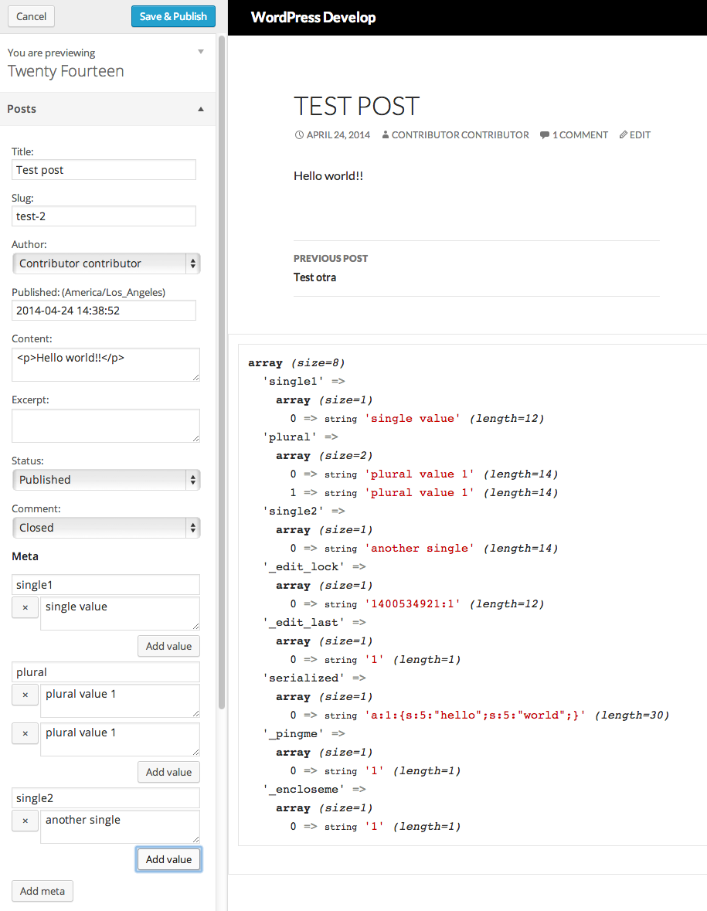

<!-- DO NOT EDIT THIS FILE; it is auto-generated from readme.txt -->
# Customize Posts

Edit posts and postmeta in the Customizer. Stop editing your posts/postmeta blind!

**Contributors:** [x-team](http://profiles.wordpress.org/x-team), [westonruter](http://profiles.wordpress.org/westonruter)  
**Tags:** [customizer](http://wordpress.org/plugins/tags/customizer), [customize](http://wordpress.org/plugins/tags/customize), [posts](http://wordpress.org/plugins/tags/posts), [preview](http://wordpress.org/plugins/tags/preview), [featured-image](http://wordpress.org/plugins/tags/featured-image), [page-template](http://wordpress.org/plugins/tags/page-template)  
**Requires at least:** 4.0  
**Tested up to:** 4.0  
**Stable tag:** trunk (master)  
**License:** [GPLv2 or later](http://www.gnu.org/licenses/gpl-2.0.html)  

## Description ##

The goal for this plugin is to be able to expose the editing of posts in the Customizer, allowing you to edit post data and postmeta for any number of posts, and preview the changes before saving them for others to see. This plugin was birthed out of the Widget Customizer feature-as-plugin project which was merged into WordPress Core in 3.9: as widgets can now be managed in the Customizer, so too should posts be editable in the Customizer as well.

This **Customize Posts** plugin is not to be confused with 10up's [**Post Customizer**](https://github.com/10up/Post-Customizer) plugin which is a complimentary effort but seeks to address different use cases. The two plugin projects have [opened a discussion](https://github.com/10up/Post-Customizer/issues/9#issuecomment-43821746) to collaborate where possible.

## Screenshots ##

### Edit posts and postmeta in the Customizer to preview them

