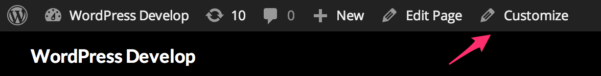

<!-- DO NOT EDIT THIS FILE; it is auto-generated from readme.txt -->
# Customize Posts

Edit posts and postmeta in the Customizer. Stop editing your posts/postmeta blind!

**Contributors:** [xwp](https://profiles.wordpress.org/xwp), [westonruter](https://profiles.wordpress.org/westonruter)  
**Tags:** [customizer](https://wordpress.org/plugins/tags/customizer), [customize](https://wordpress.org/plugins/tags/customize), [posts](https://wordpress.org/plugins/tags/posts), [preview](https://wordpress.org/plugins/tags/preview), [featured-image](https://wordpress.org/plugins/tags/featured-image), [page-template](https://wordpress.org/plugins/tags/page-template)  
**Requires at least:** 4.5-beta2  
**Tested up to:** 4.5-beta2  
**Stable tag:** trunk (master)  
**License:** [GPLv2 or later](http://www.gnu.org/licenses/gpl-2.0.html)  

 

## Description ##

The goal for this plugin is to be able to expose the editing of posts in the Customizer, allowing you to edit post data and postmeta for any number of posts, and preview the changes before saving them for others to see. This plugin was birthed out of the Widget Customizer feature-as-plugin project which was merged into WordPress Core in 3.9: as widgets can now be managed in the Customizer, so too should posts be editable in the Customizer as well.

Did you know that **changing the featured image actually makes the change live even before you save the post**? This is this very surprising/unexpected behavior. The only way to truly preview a change to a featured image is to use something like Customize Posts.

Likewise, did you know that **changing a page template cannot be previewed from the post editor?** When you change the selected page template, the change will not show up when you preview the post (see [#11049](https://core.trac.wordpress.org/ticket/11049)). However, in Customize Posts you *can* preview changes to the page template just by changing the dropdown selection, and then you can see what your page would look like with the new template after the preview refreshes.

Most other changes to metaboxes containing data that gets saved to custom fields (postmeta) also get written when clicking the Preview button. The Customize Posts plugin provides a way to get around this, and also provides a live preview of the changes. Fixing this underlying issue of incorrectly persisting postmeta when doing a preview is captured in [#20299](https://core.trac.wordpress.org/ticket/20299). The current Customize Posts UI for editing postmeta is just a non-user-firendly first stab; future iterations should make it easy to add new controls to manage postmeta, just as metaboxes are added to the post editor.

This project is collaborating with the Front-end Editor project, which is also being re-written to leverage the Customizer as the framework for previewing and persisting changes. See [#20](https://github.com/xwp/wp-customize-posts/issues/20) and [wp-front-end-editor#87](https://github.com/avryl/wp-front-end-editor/issues/87).

**Development of this plugin is done [on GitHub](https://github.com/xwp/wp-customize-posts). Pull requests welcome. Please see [issues](https://github.com/xwp/wp-customize-posts/issues) reported there before going to the [plugin forum](https://wordpress.org/support/plugin/customize-posts).**

This **Customize Posts** plugin is not to be confused with 10up's [**Post Customizer**](https://github.com/10up/Post-Customizer) plugin which is a complimentary effort but seeks to address different use cases. The two plugin projects have [opened a discussion](https://github.com/10up/Post-Customizer/issues/9#issuecomment-43821746) to collaborate where possible.

## Screenshots ##

### Edit posts and postmeta in the Customizer to preview them

### Customize link is moved to top of admin bar, and is made available to authors and editors in addition to administrators

## Changelog ##

### 0.2.4 ###
Remove shim that implemented the `customize_save_response` filter which was introduced in 4.2. The shim used a slightly different filter name and broke insertion of nav menu items in the Customizer.

### 0.2.3 ###
Change method for registering scripts/styles to fix conflict w/ Jetpack. [PR #26](https://github.com/xwp/wp-customize-posts/pull/26)

### 0.2.2 ###
Add compatibility with WordPress 4.1 now that the Customizer has a proper JS API.

### 0.2.1 ###
Supply missing `selected` attribute on `post_status` dropdown.

### 0.2.0 ###
Initial release on WordPress.org. Key new features:

* Postmeta can now be added, modified, and deleted—all of actions which are fully previewable.
* Grant `customize` capability to authors and editors who normally can't access the Customizer, so they can edit posts there.
* Move the “Customize” admin bar link to the top level, and add one for editors and authors.
* Allow the Page Template and Featured Image to be modified and previewed.

